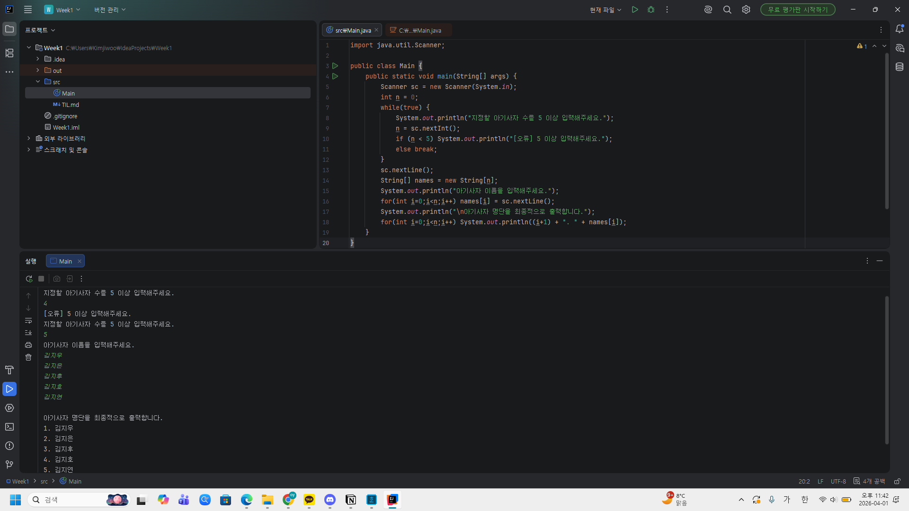

# 📘 Today I Learned

### 1. 오늘 배운 내용
- 데이터 타입
- 콘솔 입출력
- 조건문
- 반복문

공부 날짜: 2026.04.01.

### 2. 핵심 정리 (내 언어로)
1. **자바는 입력하려면 Scanner를 불러와야 함**  
   출력할 때는 `System.out.println();` 을 이용하면 되지만, 입력은 하려면 Scanner 패키지를 불러와야 함 -> **입력과 출력 모두 다른 언어들에 비해 복잡**하니 잘 기억해둬야함!
```java
import java.util.Scanner; // 이걸 불러와야 입력 받기가 기능

Scanner sc = new Scanner(System.in); // 스캐너 객체를 만들어주고
n = sc.nextInt(); // 입력 받을 때는 자료형이 뭔지 알아야 함(이건 int)
```
2. **`sc.nextLine();`이 뭐냐면...**  
   아까 `sc.nextInt();`가 int형을 읽어오는 거고 이건 한 줄 전체를 읽어옴  
   맨 처음에 실행 돌렸을 때 이름 입력 1번째가 공란이 되었던 이유도 얘가 빈 줄(\n)을 바로 읽어버렸기 때문  
   그래서 중간에 `sc.nextLine();`을 넣어서 \n을 없애고 입력 버퍼를 비워줬던 거임

### 3. 결과 이미지(스크린샷)


### 4. 느낀 점
기초적인 자바 문법을 다루면서 다른 언어와의 차이를 찾아가는 과정이 재미있다!  
학습하기 전까지는 C++과 많이 유사할 거라고 생각했는데 의외로 다른 점이 많아서 신기했다.  
이번에 학습한 내용 중에서는 `sc.nextLine();` 부분이 가장 어려웠고 아직도 조금 헷갈린다.  
확실하게 이해하기 위해 좀 더 시간을 써야 할 것 같다.